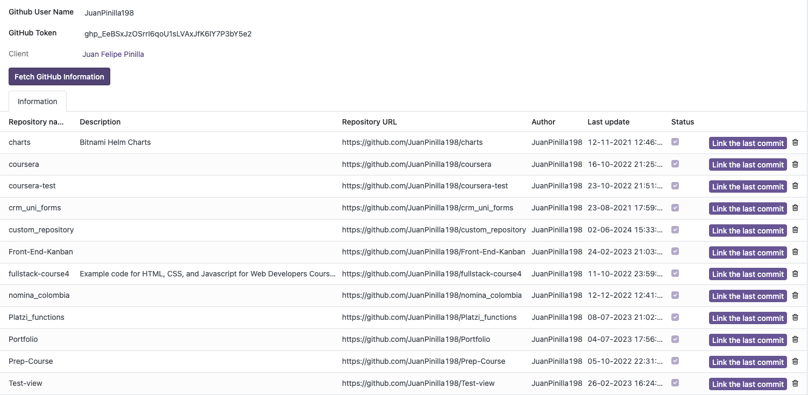

# Módulo para Odoo v17 para extraer datos de Github y crear PDF y CSV a partir de ellos.
### Creado por Juan Pinilla

El objetivo del módulo en Odoo permite registrar y gestionar información relacionada con los repositorios de código fuente de los clientes. El módulo incluye funcionalidades de visualización como administración de datos, enfocado en los detalles de los repositorios y los commits realizados.

*Para el funcionamiento del modulo debemos contar con Odoo versión 17.*

### Previo a el siguiente paso a paso de funcionamiento, el módulo debe estar incluido en la carpeta de addons (o carpeta asociada en la ruta de odoo.conf) del servidor, ya que si no esta presente en dicha carpeta, el modulo no se encontrará para la instalación.

## Instalación y permisos según rol

Como primer paso ingresamos como usuario tipo administrador:

Procedemos a realizar la instalación del módulo ingresando a las aplicaciones y realizando la búsqueda del módulo *"custom_repository"* en el buscador de la aplicaciones

Después de haber instalado el módulo, ingresamos a la sección de *Ajustes*

Buscamos en la parte superior *Usuarios y compañías* e ingresamos a *Usuarios*

En el ejemplo tenemos creados dos usuarios:

- Usuario *"Admin"* que en este caso ejercerá el rol de Administrador
- Usuario *"User"* que en este caso ejercerá el rol de Usuario

Para tener acceso al módulo *"custom_repository"* tanto como `admin` o `user` debemos otorgarle permisos.

* Para el admin se otorgan permisos de *"Commit Administrator"*

* Para el user se otorgan permisos de *"Commit User"*

## Funcionamiento del módulo

Ingresamos al módulo *"Github API"* desde el panel desplegable 

Y creamos un nuevo registro

Nos mostrará una nueva ventana donde debemos ingresar datos importantes como *Github User Name* y *Github Token*

### Si no ingresamos ningún dato nos mostrará el siguiente error

### Si ingresamos algún dato incorrecto con los cuales no tenemos resultados en la búsqueda obtenemos el siguiente error

### Dado el caso sea necesario, no se tenga conocimiento como crear un Github Token, el módulo cuenta con un botón que redirige a la documentación oficial de Github para generar el Token

### *Cuando realizamos una búsqueda con los datos correctamente, creamos un registro en el modelo **`res.partner`** con información básica del usuario y una tabla que adquiere los datos y repositorios asociados al cliente*

En el módulo también tendremos acceso a la lista de repositorios

Si ingresamos a algún registro de dicha lista, encontraremos una nueva ventana con 3 botones:

- [Fetch Github Commit](#Busqueda de commits realizados)

### Si los commits fueron realizados hace menos de 24 horas es de color verde

### Si los commits fueron realizados hace más de 24 horas es de color azul

- [Generar Reporte de Commits](#Creación de reporte en formato PDF de commits realizados)

- [Generar Reporte de Commits](#Creación de reporte en formato CSV de commits realizados)

## Cuando se inicie sesión como *USER*

Se podrá tener acceso a la información pero no podrá ejecutar acciones diferentes a la creación de reporte en formato CSV

